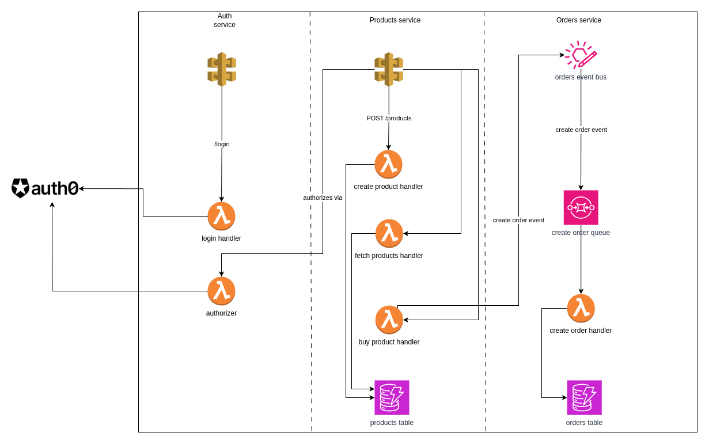

# Marketplace

This is a mini e-commerce project built with Serverless Framework on AWS and Next.js.

## Tools used

- Turborepo for managing the monorepo. 
- Serverless framework.
- Next.js.

## Backend infrastructure architecture

